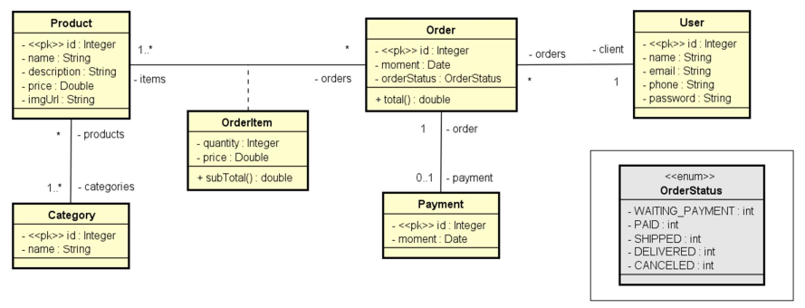

### directory structure

````
src/
└── main/
    └── java/
       └── com.javaflix.javaflix/
            ├── config/                 # The class initelize with the program
            ├── dto/                    # The class for data transfer
            ├── entities/               # Entities with the business logic
            │   └── enums/              # enumerated types
            │   └── pk/                 # Complex key
            ├── repositories/           # Interface with data access
            ├── service/                # Business logic
            ├── resources/              # Controllers
````

### Diagram Class

